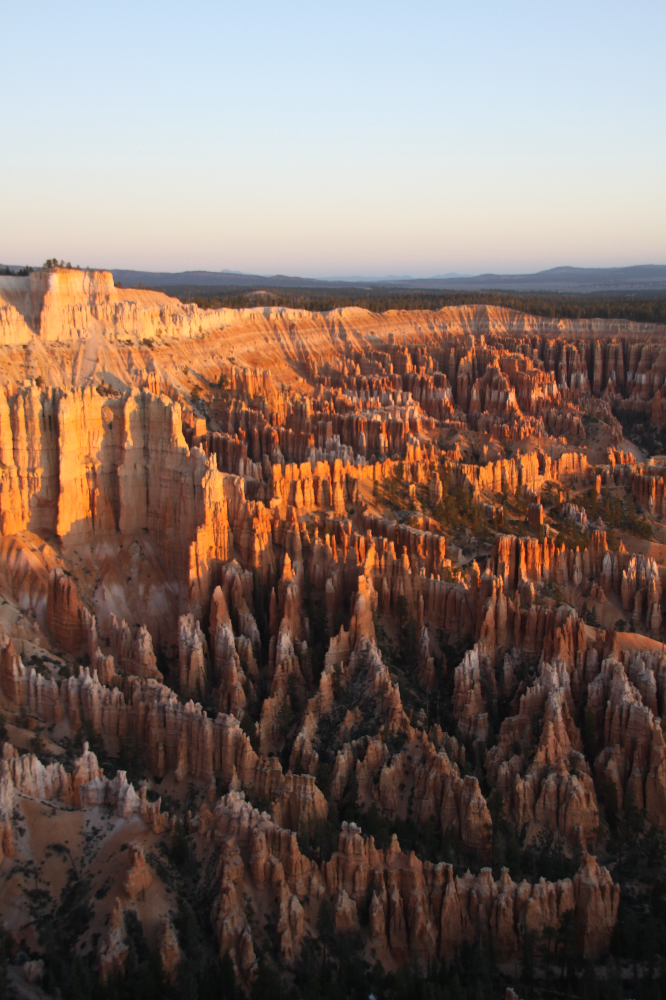

I like travelling. I enjoy the "wow" moment when I see breathtaking scenery in the wild nature. Among all the places I have been to, the Grand Circle is undoubtedly one of the best.

The Grand Circle is actually not a single place. It is a beautiful, vast region in the Southwestern part of the United States. The typical route travelers take is like a big circle, of more than 1,000km in distance. The most famous places in the Grand Circle include the Grand Canyon, Zion National Park, Bryce Canyon, Arches National Park, Antelope Canyon, to name a few.

| Grand Canyon |
|---|
||

|Antelope Canyon|
|---|
||

|Delicate Arch|
|---|
||

|Bryce Canyon|
|---|
||

|Goose Neck|
|---|
||
