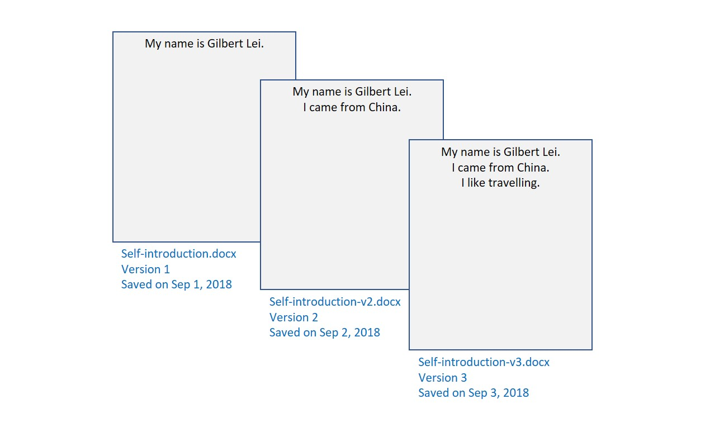
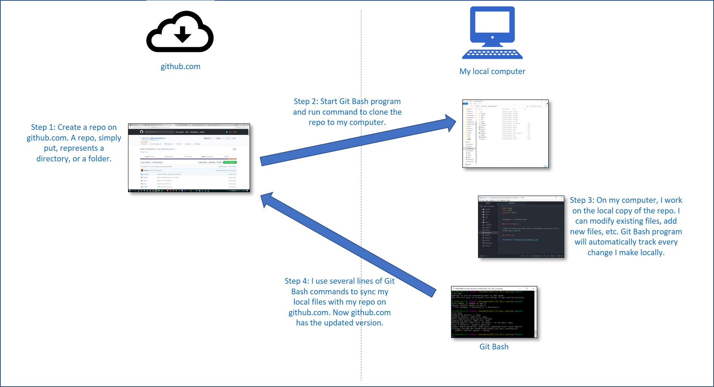

Most of us might have run into this kind of situation before: We worked on a file for quite a long time, then one day we thought the changes we recently made to the file was meaningless, so we wanted to go back to where we were one week ago. However, we might don’t have a copy of the file created one week ago, or we have saved many copies, but we could not find the copy we wanted or could not figure out which copy was the one we really wanted.

To avoid situations like this, we very often spend a lot of time on managing files on daily basis. Research ([link](https://www.cottrillresearch.com/various-survey-statistics-workers-spend-too-much-time-searching-for-information/)) shows that many people, especially engineers, spend too much time on searching for the right document and information. The main reason for this is that we they don’t have a good system to manage files.  

Github is one of the best systems to tackle this issue. Before explaining how github can help us, let's define two terms first: **version** and **version control**.

A **version** is simply a copy of a file that we save at a certain point. A version records the content and editor of the file at the time we save it. Let’s say I need to create a Word document to briefly introduce myself. On Sep 1, 2018, I started working on this “project”. I wrote the first line: *My name is Gilbert Lei*. Then I saved it as *self-introduction.docx*. This file became the *first version* of the file I was working on.

The next day, I opened this file and added a new line: *I came from China*. This time, I saved a new copy called self-introduction-v2.docx. This file is then the *second version*.

On Sep 3, I repeated the process, added another line: *I like travelling*, and saved the *third version* called *self-introduction-v3.docx*.

As we can see clearly, every time I saved a **new** copy of the file, I created a new *version*. With these different copies, whenever I want to rollback my work, I can open an old version and re-start from there.

While the above-mentioned process sounds simple and solid, there are several potential issues:
*	In real world, the documents we work on are usually much more complicated than the one I just showed. For instance, a computer programming document may take weeks, months or even years to finish. If we use above-mentioned method, we may end up saving **too many** versions, and when we want to roll back to a previous version, it is very difficult to find the right version.
*	Sometimes, we may want to compare current version with a previous version and see why the current version works/doesn’t work. Without a good tool, this seemingly easy task might be unbelievably difficult.
*	In the engineering world, it is quite common for different people to work on different parts of the **same** file. Using only file management system like Windows Explorer, it is very difficult to consolidate the work done by different people into one file.

The managing of the above-mentioned document changes is called **version control**. Github is a very powerful tool to help us overcome the challenges mentioned above, and more. Github, put it simply, has two parts: a website that can store our files and a local program that installed on our computer.

* The website is github.com. Everyone can create an account on it and store their data on it. It may take some time to get familiar with this website. But in this article, I will focus on only explaining high-level process of how it works.
* A local program is a tool to track the changes we made to our files and to sync our local files with the files we uploaded to github.com. In Windows system, this tool is called git bash.

With Github, version control is very easy. Below graph shows the steps on how to use github for version control, as shown in beloe chart.

Note:
*	The cloud image source: [click_here]( https://commons.wikimedia.org/wiki/File:Blue_computer_icon.svg)
*	The blue computer image source: [click_here]( https://icons8.com/icon/11706/download-from-the-cloud)

Github does great job tracking and storing changes we make. Whenever we want to create a new version of an existing file, we only need to run *Step 4*. Then Github will do all other work for us. For a specific file, when we want to roll back to a previous version, we can go to github.com, find that version, and use it. When we want to compare and evaluate two different versions, github.com provides a tool that compares the two files line by line, with discrepancies highlighted. It becomes very easy to see the differences and take actions according. Furthermore, Github allows different people to work on the same file simultaneously. When people sync the changes each one made locally to github.com, Github will automatically merge all the work in the same file. Hassle free!

Of course, using github is not so intuitive as using Windows Explorer. There are also some tip and tricks we need to learn. For example, when different people change the **same line** of the same file, they will find problems when syncing local changes to github.com. However, it worth to spend some time to learn and master it. For UBC MDS students, as we need to work on many projects and we also need to cooperate in projects, learning how to use Github for version control is essential.
