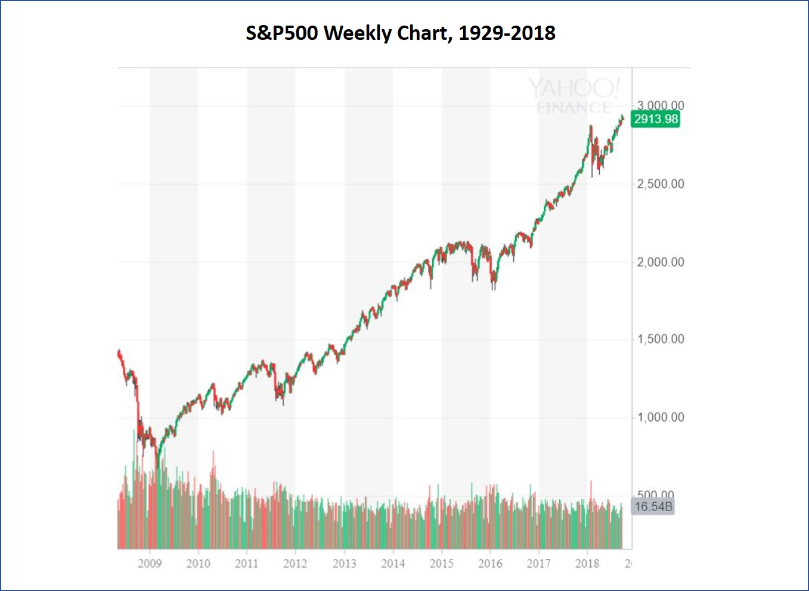
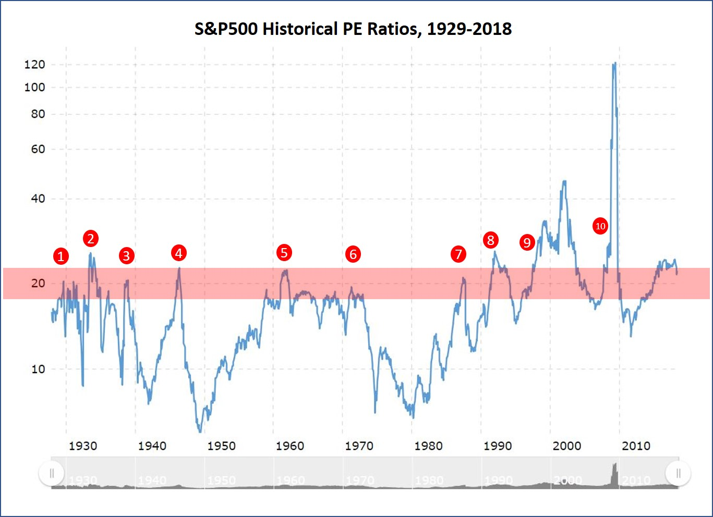
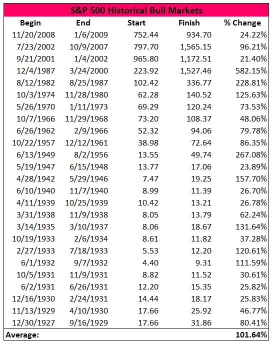
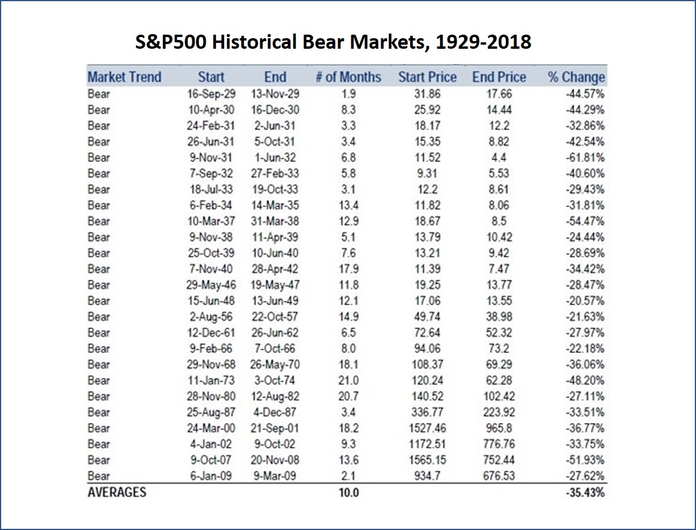

I recently became quite interested in investment, particularly stock trading. As we all know, the US stock market has been soaring in the past nine years. Consequently, many people are lured to investing in the stock market. A question comes into my mind is whether now is a good time to buy US stocks.  

Let's firstly examine the current status of the market. To do that, I will use an index called Standard & Poor's 500 to help illustrate my ideas. Standard & Poor's 500, or S&P 500, is an American stock market index. It is one of the most commonly followed equity indices, and many consider it one of the best representations of the US stock market (source: https://en.wikipedia.org/wiki/S%26P_500_Index). We don’t need to dive into the details about S&P 500. What we only need to understand is that the S&P 500 represents how the US stock market performs. When the index goes up, it means the whole US stock market is going up; when it goes down, the US stock market is going down.    

Below is a S&P 500 Weekly Chart, 1929-2018. According to this chart, the S&P 500 index reached a low of 666.79 on March 2nd, 2009 and it climbed to 2913.98 on September 24th, 2018. It means in the past 9.5 years, the S&P 500 has grown by 337%! Obviously, the US stock market went very well in this period. Stocks kept growing up and up.  

But, at this moment, on September 29th, 2018, should I buy US stocks? The answer is not that obvious.  

Before I go into detailed analysis, I want to clarify that this analysis is not about picking any specific stocks. Instead, I will focus on analyzing the whole market. If the stock market will go well, I may invest in it; if it will go downward, I may choose to stay away from it. Since S&P 500 is a very good representation of the US stock market, I will use S&P 500 data to do my analysis.  

The model I will use for this analysis is the calculation of expected value based on probability theory. The equation goes like this:  

- **Expected return = P_up \* Gain_up + P_down \* Loss_down**  

The equation may sound quite technical but is actually quite simple:  
-	P_up stands for the probability S&P 500 will keep going up.  
-	P_down stands for the probability S&P 500 will go down. In reality, S&P 500 can go up, go down, or go side way. In my analysis, to make it simple, I suppose that S&P 500 will either go up or go down, never go side way.  
-	Gain_up stands for the possible gain if S&P 500 goes up.  
-	Loss_down stands for the possible loss if S&P 500 goes down.  
- Expected return stands for the possible outcome if I invest in the US stock market now.  

If the above equation comes out a positive expected return, I will conclude that now is a good time to buy US stocks. If the expected return value comes out negative, I will stay away from the US market.  

In order to get the answer, I need find out the values of P_up, P_down, Gain_up and Loss_down.

### S&P 500 will go up or down?  
Among all the indicators people use to predict the US stock market, I will use **PE ratio** in my analysis. PE ratio, or price to earnings per share ratio, represents the valuation of the stocks. High PE ratios mean investors pay high prices for stocks. On the contrary, low PE ratios mean investors pay low prices for the same stocks. Obviously, high PE ratios come with intrinsic high risk.  

Below charts shows the historical PE ratios of S&P 500, from 1929 to 2018. It’s quite clear that most of the time S&P 500 PE ratio is below the 18~22 level. In the past during trending markets (trending market means the market either goes up or down, not side way), S&P 500 PE ratio reached the 18~22 level 10 times. In 8 of these 10 times, the PE ratios started to decline sharply, meaning the stock market started to decline sharply. The PE ratio only breakout of the 18~22 level 2 out of the 10 times. Statistically, when S&P 500 PE ratio reached the 18~22 level, there is 20% chance the stock market will go up and 80% chance it will go down. Since currently the S&P PE ratio has reached the 18~22 level, I conclude that in the follow 12 months:   
- P_up = 20%  
- P_down = 80%  

  
(Source: https://www.macrotrends.net/2577/sp-500-pe-ratio-price-to-earnings-chart )

### How much I will gain if S&P 500 goes up?
If the stock market goes up, how much it will climb? Below chart shows the statistics of the S&P 500 historical bull markets. It shows that the average gain from a bull market is 101.64%. The bull market we are in now, as mentioned above, has grown by 337%! So by statistical term, there is no more room for growth. Therefore, I conclude:  
- Gain_up = 0%

  
(reference: https://seekingalpha.com/article/3987722-2nd-longest-bull-market-history)

### How much I will loss if S&P 500 goes down?
On the other hand, if the current market has reached its peak and will turn into a bear market, how deep will it decline? Below chart shows the statistics of the bear markets from 1929 to 2018. It shows that the average decline is -35.43%. It means:  
- Loss_down = -35.43%

  
(Source: https://www.gold-eagle.com/article/history-us-bear-bull-markets-1929)

### Conclusion
From above analysis, I get P_up = 20%, P_down = 80%, Gain_up = 0%, Loss_down = -35.43%. So the expected return from my investment will be:  
- Expected return = 20% \* 0% + 80% \* (-35.43%) = -28%  

It means if I invest in the US stock market now, I may end up losing 28% in one year. Obviously, it is not a good idea to buy US stocks at this moment.  

The model I used has some downsides though. It doesn't take into consideration other important factors, such as the economy growth, interest rate changes, geopolitical dynamics, etc. However, it still provides reasonable method to help me, a risk-averse person, to make investment decisions. 
