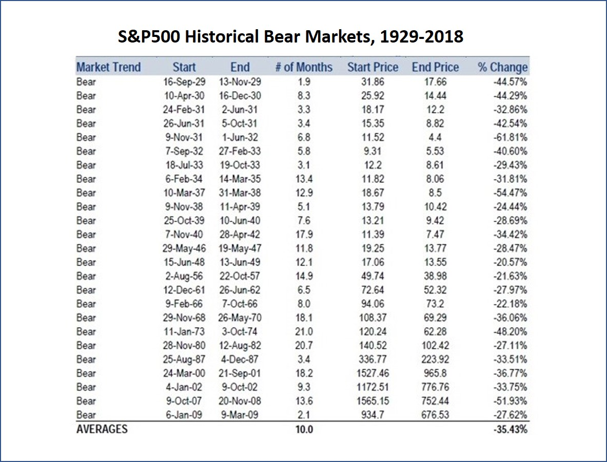

# Is Now A Good Time to Buy US Stocks?

I recently have become quite interested in investment. While there are many types of investments available in the market, such as buying stocks, buying gold, investing in real estates, trading futures, trading foreign exchanges, etc., the investment I am particularly interested in is stock trading. As you know, the US stock market has been soaring in the past nine years, a question that comes into my mind is whether it is a good idea to buy US stocks now, or not.  

Below chart shows the Standard & Poor's 500 Index from 2008 to 2018. Standard & Poor's 500, or S&P 500, is an American stock market index based on the market capitalizations of 500 large companies having common stock listed on the NYSE or NASDAQ. It is one of the most commonly followed equity indices, and many consider it one of the best representations of the U.S. stock market. (source: https://en.wikipedia.org/wiki/S%26P_500_Index) We don’t need to dive into the technical calculation of S&P 500. What we need to know is that the S&P 500 Index represents how the US stock market performs. When the index goes up, it means the whole market is going up; when it goes down, the market goes down.  

According to this chart, the S&P 500 reached a low of 666.79 on March 2nd, 2009 and it climbed to 2913.98 on September 24th, 2018. It means in the past 9.5 years, the S&P 500 has grown by 337%! Obviously, this is what people called bull market. Stocks kept growing up and up.  

But at this moment, on September 29th, 2018, should I buy US stocks? The answer is not that obvious.  

Before I go into detailed analysis, I want to clarify my scope of analysis. As we know, there are underperforming stocks in bull market and outperforming stocks in bear market. In this project, I will not analyze any specific stocks; instead, I will focus on the overall market. Since S&P 500 is a very good representation of the US stock market, I will use S&P 500 data to do my analysis.  

The model I will use in this analysis is the calculation of expected value based on probability theory. The equation goes like this:  

Expected return = P_up \* Gain_up + P_down \* Loss_down  

It sounds quite technical but is actually quite simple.  
-	P_up stands for the probability S&P 500 will keep going up,
-	P_down stands for the probability S&P 500 will go down. In reality, S&P 500 can go up, go down, or go side way. In my analysis, to make it simple, I suppose that S&P 500 will either go up or go down, never go side way.
-	Gain_up stands for the possible gain if S&P 500 really goes up.
-	Loss_down stands for the possible loss if S&P 500 goes down.
If the above equation gives a positive “expected return” value, it means it is a good idea to buy US stocks now. If the “expected return” value is negative, it means if I buy US stocks now, I may end up losing money.  

So to get the answer, I will find out the value of P_up, P_down, Gain_up and Loss_down.

### S&P 500 will go up or down?  
People use all kinds of indicators to forecast the direction of the market. The one most commonly used is PE ratio, or price to earnings per share ratio. Basically, PE ratio shows the valuation of the stocks. When PE ratios are high, investors pay high prices for stocks. On the contrary, when PE ratios are low, investors pay low prices for stocks. Therefore, usually high PE ratios come with high risk. In my analysis, I will also use the historical PE ratio of S&P 500 as an indicator for market trend.  

Below charts shows the historical PE ratios of S&P 500, from 1929 to 2018. It’s quite clear that most of the time S&P 500 PE ratio is below 20加减2 level. In the past, S&P 500 PE ratio reached the 20加减2 level 10 times. In 8 of these 10 times, the PE ratios started to decline sharply, meaning stocks started to decline accordingly. The PE ratio only breakout of the 20加减2 level twice. Statistically, when the PE ratio reached the 20加减2 level, there is 20% chance the stock market will go up and 80% chance it will go down:   
- P_up = 20%  
- P_down = 80%  

  
(Source: https://www.macrotrends.net/2577/sp-500-pe-ratio-price-to-earnings-chart )

### How much I will gain if S&P 500 goes up?
If the stock market goes up, how much it will climb? Below chart shows the statistics of the S&P 500 historical bull markets. It shows that the average gain from a bull market is 101.64%. The bull market we are in now, as mentioned above, has grown by 337%! So by statistical term, there is no more room for growth. Therefore, I conclude:  
- Gain_up = 0%

  
(reference: https://seekingalpha.com/article/3987722-2nd-longest-bull-market-history)

### How much I will loss if S&P 500 goes down?
On the other side, if the current market has reached its peak and will turn into a bear market, how deep will it decline? Below chart shows the statistics of the bear markets after previous bull markets. It shows the average decline is -35.43%. I will use this number in my calculation:  
- P_down = -35.43%

  
(Source: https://www.gold-eagle.com/article/history-us-bear-bull-markets-1929)

### Conclusion
From above analysis, I get P_up = 20%, P_down = 80%, Gain_up = 0%, Loss_down = -35.43%. So the expected return from my investment will be:  
- Expected return = 20% \* 0% + 80% \* (-35.43%) = -28%  

It means if I invest in the US stock market now, I may end up losing 28% in one year. Obviously, it is not a good idea to buy US stocks at this moment.
