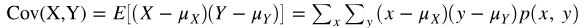
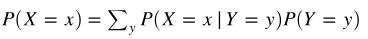
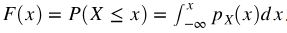
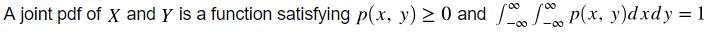

Data science has basically two pillars: computer science and statistics. While computer science provides a computing platform for data science, statistics provides all the theories and models for the analysis work in every data science project.

## Discrete Random Variables
- boolean algebra
- set notation
- probability
- variables
- discrete univariate
- discrete multivariate
- continuous univaraite
- continuous multivariate
- probability distribution
- PMF (Probability Mass Function): a function that gives the probability that a discrete random variable is exactly equal to some value.
- CDF (Cumulative distribution Function): defines the probability that X will take a value less than or equal to *x*.
- properties of a distribution: mean, median, mode, variance, standard deviation, quantiles, entropy
- entropy defines the "level of uncertainty" of the outcome. When there is no randomness, entropy will be zero. When randomness of outcome is high, entropy will be high.
- linearity of expectations: when we say the expected value is *linear* in *x*, it means:
```
*E[aX] = aE[X]*
*E[x + Y] = E[X] + E[Y]*
```
- conditional probability: *P(A|B) = P(A and B)/P(B)*
- conditional expectations
- conditional distribution

## Well-Known Discrete Distributions
- **Bernoulli distribution**: A variable that is either 1 (with probability *p*) or 0 (with probability *1-p*). The mean is also *p*.
- **Binomial distribution**: The sum of *n* Bernoullis. Parameters: *p* and *n$*.
- **Categorical distribution**: Generalized Bernoulli to more than 2 values.
- **Uniform distribution**: A special case of categorical (sort of), in which *p_i=1/K* for all *i=1,...,K*.
- **Multinomial distribution**: Generalized binomial to more than 2 values per trial. Parameters: *n*, *p_i* for *i=1,...,K*.
- **Geometric distribution**: The number of attempts to achieve your first "success" in sequential trials. Parameter *p* is the probability of success
- **Poisson distribution**: has only one parameter, the mean, typically called $\lambda$

## Discrete Multivariate Distribution
**Joint distribution:**
- *P(X=x, Y=y, Z=z)*
- when we say random variable X and Y are independent to each other, it means:
```
P(X, Y) = P(X)P(Y)
P(X|Y) = P(X)
E[XY] = E[X]E[Y]
```

**marginal distribution:**  
assume *X* and *Y* have a joint PMF *P(x, y)*:
- *P(X = x_i)* is a marginal probability
- *P(X = x)* is a marginal distribution

**properties of multivariate distribution**  
- Covariance  

- Correlation  


**Bayes' Theorem:**
*P(A|B) = P(B|A) P(A) / P(B)*  

**Law of total probability:**  



## Continuous Random Variables
- PDF (Probability Density Function): defines the distribution of a continuous random variable.
- PDF is not probability, it is density
- probability of a particular value is zero. probability can only be calculated for a value zone.
- CDF (Cumulative distribution Function): defines the probability that X will take a value less than or equal to *x*.  
  
- Expected values
- Expected values of functions
- joint PDF:  



## Well-Known Continuous Distributions  
- Uniform distribution: *p(x) = 1/(b-a)* for *a<x<b*
- Gaussian distribution (aka "Normal distribution"): Parameters: mean, standard deviation
- Exponential distribution
- Beta distribution

## Relevant R Functions
- The uniform distribution: *dunif()*, *punif()*, *qunif()*, *runif()*
- The normal (Gaussian) distrubution: *dnorm()*, *pnorm()*, *qnorm()*, *rnorm()*
- The exponential distribution: *dexp()*, *pexp()*, *qexp()*, *rexp()*

## Metrices
- Random vector
- multivariate Gaussian covariance matrix
- how many parameters?

## Relevant Python Functions
- random numbers: *randn()*, *rand()*, *randint()*
- probability functions: *binom.pmf()*

## Maximum Likelihood Estimation (MLE)
- MLE is NOT a probability distribution
