Now I am going to summarize statistical inference and computation. The key will be how to use sample data and statistical methods to infer parameters of the entire population.

##  Important statistical inference terms
- **population**
- **estimate**
- **population parameter**
- **point estimate**: For example, the sample mean x is a point estimate of the population mean μ
- **sample**
- **observation**
- **observational unit**: is an entity/object from which information (a quantity or a quality) is collected
- **population distribution**
- **sample distribution**: distribution of all data points in a single sample
- **sampling distribution**: a distribution of a *sample statistic* over many random samples from a single population. Regardless of the shape of the population distribution, the sampling distribution always follows a normal distribution. The center of the sampling distribution is at the center of the population distribution.   
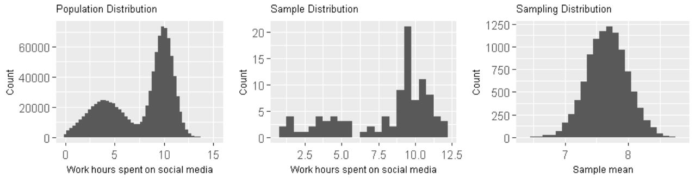  
- **standard deviation of sample**: measures the dispersion of sample observations around the sample mean.  
- **standard error**: the standard deviation of the *sampling distribution*, measures the dispersion of sample means around the population mean.
```
SE = s/sqrt(n)      # s is the standard deviation of the sample,
                    # n is the number of observation in the sample
```

## What is Statistical Inference/Estimation?
We want to get population parameters, such as mean. But, in reality, we may never get the exact population parameters. So statisticians developed three methods to get plausible estimates of population parameters.

The first one is called sampling. It is actually a quite straightforward method. You firstly take samples from the population repeatedly, say 100 times. Then, you calculate the mean of each sample. With these 100 sample means, you can draw a distribution, calculate the standard deviation and also calculate confidence interval. The standard deviation here is also called standard error. The confidence interval is a good estimate of the population mean.  

The second method is called bootstrapping. Bootstrapping needs only one sample from the population. So when you have only one sample, bootstrapping is the way to go. Basically it uses computing power to shuffle the observations in the sample and virtually create many more "samples". Then based on these "samples", it calculates statistic of each "sample". Then, just like using sampling method, you will get a distribution, standard deviation and lastly confidence interval.  

The last method is based on asymptotic theory (Central Limit Theorem, CLT). It uses only one sample, just like bootstrapping does. The big difference is that, instead of creating virtual "samples", asymptotic theory based method uses some pre-defined equations to calculate standard error and confidence interval. Of course, to use this method, the single sample available must meet some conditions.  

## Estimation based on Bootstrapping  
Suppose we want to estimate population mean. We have one sample, but we have no access to take more samples. In this case, we can use bootstrapping to reach our goal.   

**Bootstrapping process:**
1. Take a bootstrap sample - a random sample taken with replacement from the original sample, of the same size as the original sample
2. Calculate the bootstrap point estimate (e.g., mean, median, proportion, slope, etc.) computed on the bootstrap sample
3. Repeat steps (1) and (2) many times to create a bootstrap distribution - a distribution of bootstrap point estimates
4. Calculate the confidence interval of our observed point estimate

**Generate bootstrapping distribution in R:**
```
# generate bootstrap samples
bootstrap_samples <- one_sample %>%
  rep_sample_n(size = 40, replace = TRUE, reps = 100)

# generate and visualize bootstrapping distribution
ungroup(one_sample) %>%
    specify(response = age) %>%
    generate(reps = 1000) %>%
    calculate(stat = "mean") %>%
    visualize()

# visualize bootstrapping distribution using ggplot
# ggplot provides much more control on the plot  
ungroup(one_sample) %>%
    specify(response = age) %>%
    generate(reps = 1000) %>%
    calculate(stat = "mean") %>%
    ggplot(aes(stat)) +
    geom_histogram()

```

**Calculate and visualize confidence interval in R:**
```
bootstrap_distribution <- ungroup(one_sample) %>%
    specify(response = age) %>%
    generate(reps = 1000) %>%
    calculate(stat = "mean")

confidence_ci <- bootstrap_distribution %>%
    get_ci()  

bootstrap_distribution %>%
    visualize(endpoints = percentile_ci, direction = "between")

# visualize confidence interval using ggplot
bootstrap_distribution %>% ggplot(aes(x = stat)) +
  geom_histogram() +
  geom_vline(xintercept = c(percentile_ci[[1]], percentile_ci[[2]]),
            color = "blue", lty = 2)
```

## Estimation based on asymptotic theory (Central Limit Theorem, CLT)  

We have only a single sample. CLT tells us what the sampling distribution should look like. And sampling distribution can be used to infer population parameters.  

**Conditions:**
- Sample size is large enough: numerical data, n>30 is considered large; categorical data, at least 10 successes and 10 failures.
- Sample observations must be independent: the sample must be random; the sample size must be less than 10% of population size.

If above conditions are met, the sampling distribution of the sample statistic will be nearly normally distributed with mean equal to the population parameter and standard error proportional to the inverse of the square root of the sample size.

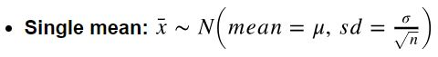
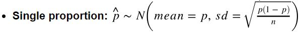
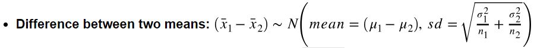
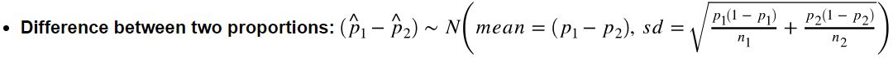

**With CLT, we can infer population parameters based on the statistic of a single sample.**  
- use Z test for proportions estimate
- use T test for means estimate
- confidence interval calculated based asymptotic theory is wider than that generated from simulation (bootstrapping).

For example, below is the equation for calculating of confidence interval based on Z test.   
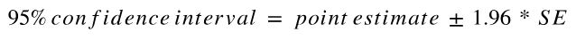

**How to calculate point estimate?**  
Calculate directly using sample data. For example, if the hypothesis test is about population mean, then point estimate is the mean of the sample.  

**How to calculate SE? (note: SE is the standard deviation of sampling distribution)**  
- Single mean:  
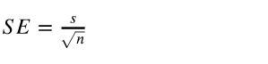
- Single proportion:  
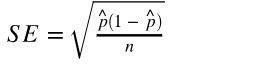
- Difference between two means:   

- Difference between two proportions:  
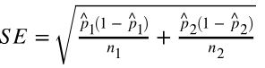


## Hypothesis Test based on bootstrapping  
**5 steps to a hypothesis test**  
1. Define your null and alternative hypotheses.
2. Compute a test statistic (𝛿*) that corresponds to the null hypothesis.
3. Use a model of the null hypothesis to generate a random dataset similar to the original dataset (𝛿) and calculate a test statistic from that randomly generated dataset (do this many times to generate a distribution).
4. See where your test statistic (𝛿*) from your sample(s) falls on this distribution. (or calculate p-value)
5. If it is near the extremes (past some threshold) you reject the null hypothesis, otherwise you fail to reject the null hypothesis. (or if p-value is smaller than threshold, you reject the null hypothesis, otherwise you fail to reject it.)


**Hypothesis test based on bootstrapping in R**  

It is very easy to do hypothesis test in R. Take the webpage clicks example. Below code generate p-value, with which we could conclude whether to reject the null hypothesis or not.  

```
# below functions are from 'infer' package  
# these functions generate the simulated data under the null hypothesis.
# for each simulated sample, calculate a test statistic.
click_through %>%           # click_through is the original sample data
    specify(formula = click_target ~ webpage, success = "1")  %>%
    hypothesize(null = "independence") %>%
    generate(reps = 15000)  %>%
    calculate(stat = "diff in props", order = c("Services", "Interact")) %>%
    get_pvalue(obs_stat = delta_sample, direction = "both")
```

If we want to visualize the bootstrapping distribution, confidence interval and test statistic (𝛿*), we can use below code.
```
# generate null distribution
null_dist <- click_through %>%
    specify(formula = click_target ~ webpage, success = "1")  %>%
    hypothesize(null = "independence") %>%
    generate(reps = 15000)  %>%
    calculate(stat = "diff in props", order = c("Services", "Interact"))

# visualize null distribution
(h0_dist <- null_dist %>% visualize())

# calculate 95% confidence interval
(threshold <- quantile(null_dist$stat, c(0.025, 0.975)))

# visualize 95% confidence interval on null distribution plot
(h0_dist <- h0_dist + geom_vline(xintercept = c(threshold[[1]], threshold[[2]]),
                     color = "blue", lty = 2))

# visualize 𝛿* on null distribution plot
(h0_dist <- h0_dist +
    geom_vline(xintercept = delta_sample, color = "red"))
```

**infer structure cheatsheet**  
```
df %>%  
  specify(response, explanatory) %>% # explanatory is optional  
  generate(reps, type) %>%  # type: bootstrap, simulate, or permute  
  calculate(stat)
```
- Always start with data frame  
- Result is always a data frame with a variable called *stat*  
  - See the documentation for *calculate* to see which statistics can be calculated  
- For hypothesis testing add a *hypothesize()* step between *specify()* and *generate()*  
  - for a threshold test choose *null = "point"*, and then specify the null value  
  - for a group comparison test (e.g., diff in means) choose *null = "independence"*  


## Hypothesis Test based on asymptotic theory (Central Limit Theorem, CLT)
**5 steps to a hypothesis test**
1. calculate *test statistic* based on the model of null hypothesis. For hypothesis tests we are encoding the sample variability in the test statistic
2. calculate *p-value* based on the corresponding test model (Z-test, t-test, etc.)
3. review *p-value* and decide to reject the null hypothesis or not

**Common tests and their test statistics:**
```
Hypothesis test	 Test statistic
---------------   ---------------
Z-test	           Z-statistic
t-tests	          t-statistic
ANOVA	            F-statistic
Chi-square tests     Chi-square statistic
```
- Z-test for proportions
- T-test for means

**How to calculate test statistic (𝛿*)?**    
- single mean (t-test):   
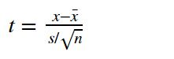  
note: the degree of freedom of this t-statistic is df = n - 1.

- difference between two means (t-test):  
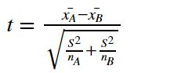  
note:
  - the degree of freedom of this t-statistic is df = n_A + n_B - 2.
  - x_bar is sample mean of each group.  
  - S is the common variance of two samples. It can be calculated by:   
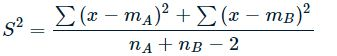  

- single proportion (z-test):  
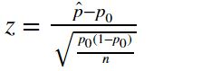  
note: p_hat is the sample proportion, p_0 is the null hypothesized value, n is sample size.   
- difference between two proportions (z-test):  
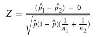  
note: p_hat is the proportion combined.

**How to calculate p-value?**  
- for t-test:  
p-value <- pt(-abs(t)) + pt(abs(t), lower.tail = FALSE)  
- for Z-test:   
p-value <- pnorm(-abs(Z)) + pnorm(abs(Z), lower.tail = FALSE)


**Z-test and t-test in R**   
There is a *z.test()* function in R. With this function, we can quickly run a Z-test without calculating all the numbers discussed above. Below are two examples showing how to use this function.  
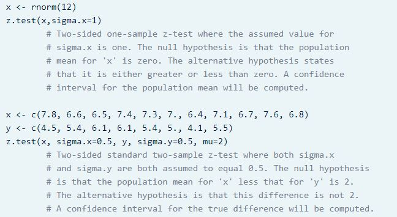   
note: both examples are from RDocumentation website. [link](https://www.rdocumentation.org/packages/BSDA/versions/1.2.0/topics/z.test)

We can also handily run t-test with *t.test()* function in R. Below is an example.    
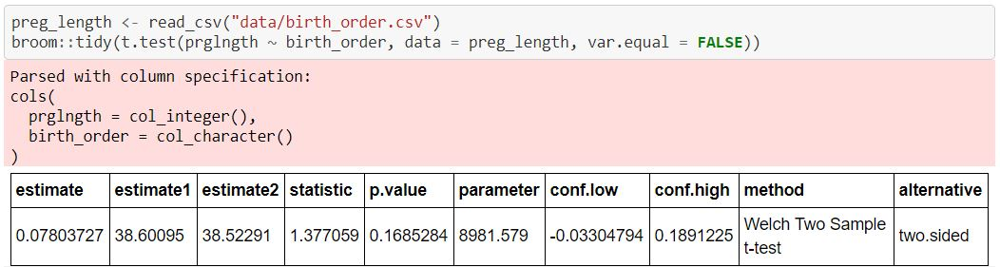  
note: this example comes from a lab assignment I finished for UBC MDS course DSCI 552.  
