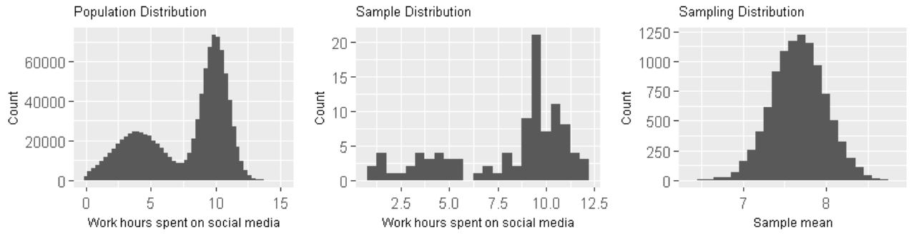
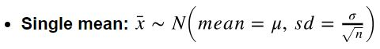
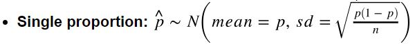
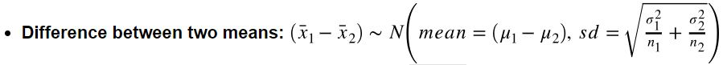
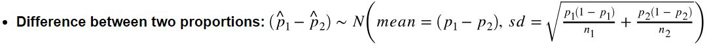
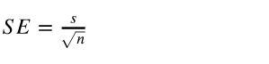
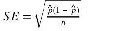
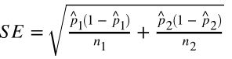

Now I am going to summarize statistical inference and computation. The key will be how to use sample data and statistical methods to infer parameters of the entire population.

##  Important statistical inference terms
- population
- estimate
- population parameter
- **point estimate**: For example, the sample mean x is a point estimate of the population mean μ
- sample
- observation
- observational unit: is an entity/object from which information (a quantity or a quality) is collected
- **population distribution**
- **sample distribution**: distribution of all data points in a single sample
- **sampling distribution**: a distribution of a *sample statistic* over many random samples from a single population
  
- standard deviation of sample: measures the dispersion of sample observations around the sample mean.  
- standard error: the standard deviation of the *sampling distribution*, measures the dispersion of sample means around the population mean.
```
SE = s/sqrt(n)      # s is the standard deviation of the sample,
                    # n is the number of observation in the sample
```

## Sampling
Suppose we want to estimate population mean. We take samples from population for 100 times. We calculate the mean from each sample. We can draw the distribution of these 100 sample means, calculate the standard deviation of these means and also calculate confidence interval. The standard deviation here is also called standard error.   

## Bootstrapping  
Suppose we want to estimate population mean. We have one sample but we have no access to take more samples.  

**Bootstrapping method:**
- Take a bootstrap sample - a random sample taken with replacement from the original sample, of the same size as the original sample
- Calculate the bootstrap point estimate (e.g., mean, median, proportion, slope, etc.) computed on the bootstrap sample
- Repeat steps (1) and (2) many times to create a bootstrap distribution - a distribution of bootstrap point estimates
- Calculate the confidence interval of our observed point estimate

**Bootstrapping in R:**
```
# generate bootstrap samples
bootstrap_samples <- one_sample %>%
  rep_sample_n(size = 40, replace = TRUE, reps = 100)

# generate and visualize bootstrapping distribution
ungroup(one_sample) %>%
    specify(response = age) %>%
    generate(reps = 1000) %>%
    calculate(stat = "mean") %>%
    visualize()

# visualize bootstrapping distribution using ggplot
# ggplot provides much more control on the plot  
ungroup(one_sample) %>%
    specify(response = age) %>%
    generate(reps = 1000) %>%
    calculate(stat = "mean") %>%
    ggplot(aes(stat)) +
    geom_histogram()

```

## Confidence interval
**Calculate and visualize confidence interval in R:**
```
bootstrap_distribution <- ungroup(one_sample) %>%
    specify(response = age) %>%
    generate(reps = 1000) %>%
    calculate(stat = "mean")

confidence_ci <- bootstrap_distribution %>%
    get_ci()  

bootstrap_distribution %>%
    visualize(endpoints = percentile_ci, direction = "between")

# visualize confidence interval using ggplot
bootstrap_distribution %>% ggplot(aes(x = stat)) +
  geom_histogram() +
  geom_vline(xintercept = c(percentile_ci[[1]], percentile_ci[[2]]),
            color = "blue", lty = 2)
```

## Central Limit Theorem (CLT)  
**Conditions:**
- Sample size is large enough: numerical data, n>30 is considered large; categorical data, at least 10 successes and 10 failures.
- Sample observations must be independent: the sample must be random; the sample size must be less than 10% of population size.

**With CLT, we can infer population parameters based on the statistic of a single sample.**  
If certain conditions are met, the sampling distribution of the sample statistic will be nearly normally distributed with mean equal to the population parameter and standard error proportional to the inverse of the square root of the sample size.






## Hypothesis Test based on bootstrapping  
**5 steps to a hypothesis test**  
- Define your null and alternative hypotheses
- Compute a test statistic (𝛿*) that corresponds to the null hypothesis
- Use a model of the null hypothesis to generate a random dataset similar to the original dataset (𝛿) and calculate a test statistic from that randomly generated dataset (do this many times to generate a distribution)
- See where your test statistic (𝛿*) from your sample(s) falls on this distribution
- If it is near the extremes (past some threshold) you reject the null hypothesis, otherwise you fail to reject the null hypothesis.


**Hypothesis test in R**  

Take the webpage clicks example. Below code generate p-value, with which we could conclude whether to reject the null hypothesis.  

```
# below functions are from 'infer' package  
click_through %>%           # click_through is the raw sample data
    specify(formula = click_target ~ webpage, success = "1")  %>%
    hypothesize(null = "independence") %>%
    generate(reps = 15000)  %>%
    calculate(stat = "diff in props", order = c("Services", "Interact")) %>%
    get_pvalue(obs_stat = delta_sample, direction = "both")
```

If we want to visualize the bootstrapping distribution, confidence interval and test statistic (𝛿*), we can use below code.
```
# generate null distribution
null_dist <- click_through %>%
    specify(formula = click_target ~ webpage, success = "1")  %>%
    hypothesize(null = "independence") %>%
    generate(reps = 15000)  %>%
    calculate(stat = "diff in props", order = c("Services", "Interact"))

# visualize null distribution
(h0_dist <- null_distribution_webpage %>% visualize())

# calculate 95% confidence interval
(threshold <- quantile(null_distribution_webpage$stat, c(0.025, 0.975)))

# visualize 95% confidence interval on null distribution plot
(h0_dist <- h0_dist + geom_vline(xintercept = c(threshold[[1]], threshold[[2]]),
                     color = "blue", lty = 2))

# visualize 𝛿* on null distribution plot
(h0_dist <- h0_dist +
    geom_vline(xintercept = delta_sample, color = "red"))
```

**infer structure cheatsheet**  
```
df %>%  
  specify(response, explanatory) %>% # explanatory is optional  
  generate(reps, type) %>%  # type: bootstrap, simulate, or permute  
  calculate(stat)
```
- Always start with data frame  
- Result is always a data frame with a variable called *stat*  
  - See the documentation for *calculate* to see which statistics can be calculated  
- For hypothesis testing add a *hypothesize()* step between *specify()* and *generate()*  
  - for a threshold test choose *null = "point"*, and then specify the null value  
  - for a group comparison test (e.g., diff in means) choose *null = "independence"*  


## Hypothesis Test based on CLT
Suppose we have only one sample, sample size is *n*.  

Firstly, calculate confidence interval using below equation:  


**How to calculate point estimate?**  
Calculate directly using sample data. For example, if the hypothesis test is about population mean, then point estimate is the mean of the sample.  

**How to calculate SE?**  
- Single mean:  

- Single proportion:  

- Difference between two means:   

- Difference between two proportions:  



**How to calculate test statistic?**   


**Common tests and their test statistics include:**
```
Hypothesis test	 Test statistic
---------------   ---------------
Z-test	           Z-statistic
t-tests	          t-statistic
ANOVA	            F-statistic
Chi-square tests     Chi-square statistic
```
