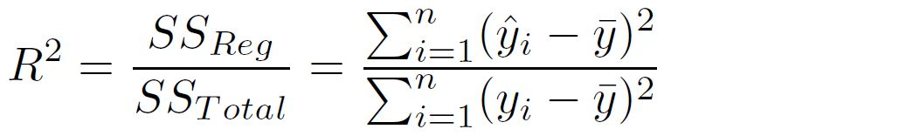

In this blog, I am going to summarize linear regression.

- A regression analysis is used to model the relationship between a dependent variable and one or more independent variables.
- independent variables are also called `explanatory variables`, `covariates`, `predictors`.
- The most common regression is linear regression.

## R functions related to linear regression  
- **t.test()**, can be used to analyze only two samples
  ```
  # test whether the means of category 1 and category 2 are equal
  t.test(category_1_data, category_2_data, var.equal=T)  	
  ```
    
- **aov()**, ANOVA test, can be used to analyze two or more samples.   
  ```
  # test whether the mean values are equal
  # if there is only one independent_variable and only two groups in this independent_variable,
  # this ANOVA test is the same as t-test
  summary(aov(dependent_variable ~ independent_variables, data = sample_data))
  ```
    

- **lm()**, can be used to analyze two or more samples
  ```
  # test whether the means are equal
  lm(dependent_variable ~ independent_variables, data=sample_data)
  # use broom::tidy() to tidy output from lm()
  broom::tidy(lm(value~factor, data=sample_data))
  ```
    

## ANOVA explained
- MSB: mean squares between  
  
- MSW: mean squares within  
  
- F statistic  
   
note: F statistic follows F distribution.  


## lm() explained  

Suppose we want to model the relationship between house prices and house ages (two-level factor) and house sizes. We will consider the interaction between house ages and house sizes. A lm() function will generate a vector of parameters contains:  
- *age_factor_C*     # this is the intercept of C. also called 'reference'  
- *age_factor_O*     # this is the change of intercept due to different age factor (O vs. C). also called 'treatment effect'. it measures the difference in sample means  
- *size_C*           # this is the slope of size for C   
- *size_O*           # this is the change of slope due to different age factor (O vs. C)   

Tests are always testing that the parameters (β0, β1, …) equal to zeros. Example:
  
When we do not consider the interaction between parameters, there will be only one slope. example:
  

## Use Linear Model in Estimation/Inference  
A typical linear model looks like this:  
  
We use linear regression to estimate population parameters and also forecast *y* based on new *x*.  
  
- **confidence interval of intercept**   
  
- **confidence interval of slope**   
  

- **Confidence interval** of the prediction: the confidence interval for population mean   
  
we can use *lm()* function to generate confidence interval of the prediction  

- **Prediction interval**: the confidence interval for new point estimates  
  
  
we can use *lm()* function to generate prediction intervals.


## How to Measure the Goodness of Fit  
One important measurement is the `coefficient of determination`  
    

  
- in above equation, SS_Total stands for the sum of squared error of an intercept-only model.  
- because R^2 unnecessarily increases with additional explanatory variables, statistician created adjusted R^2, which takes into account the size of the model so that the index won't be skewed due to additional explanatory variables.  

  

Because R^2 does not have a known distribution so we can not use it to test the hypothesis that our full model is better than an intercept-only model. Statistician came out with a F-statistic.  
  
- with F-statistic, we can run F-test to test relevant hypothesis.  
