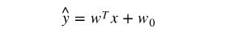
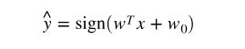

Machine Learning is probably the most import application of Data Science. Based on how the `learning` happens, machine learning is categorized into two types: supervised learning and unsupervised learning.

Supervised learning means the `machine` (computer program) learns from data that has been labeled. For example, we provide many emails, each has been labeled as `spam` or `non-spam`. The computer program analyzes the content of each email and find patterns between email contents and labels. With these patterns, the program can then analyze a **new** email and predict whether it is a spam or non-spam.  

Unsupervised learning means the `machine` learns from unlabeled contents and make judgements by itself. For example, we provide many news without labelling each news. The task for the program is to group these news by topics. Since it is impossible for human to label every news, the program has to decide by itself which news are having the same topics.  

This blog summarizes the most common unsupervised learning models.  
*Based on the nature of the problem, machine learning problems can be divided into two categories: regression or classification.*  

## Decision Trees
- Firstly, the model learn from training data and define split thresholds.  
- Then, the model uses these split thresholds on any new data points and predict.  
- Decision tree is parametric model. As such, it is very fast when predicting.  
- Scikit-learn implmentation: `DecisionTreeClassifier`.  
- Key hyperparameters: *depth*.

## K-nearest neighbors (KNN)
- There is no training phase.  
- When a new data point is given, find the K-nearest neighbors, and the classification of the new data point is the mode of these KNN.  
- Key hyperparameters: *k*  
- Scikit-learn implmentation: `KNeighborsClassifier`.

## Naive Bayes
- This model is based on `Bayes' theorem`.   
- Naive Bayes needs laplace smoothing to deal with elements that are not present in current training data.  
- Key hyperparameters: *laplace smoothing strength*.  
- Scikit-learn implmentation: `BernoulliNB`, `GaussianNB`, `MultinomialNB`.  
- Differences between `BernoulliNB`, `GaussianNB` and `MultinomialNB`:
  - **Bernoulli Naive Bayes**: It assumes that all our features are binary such that they take only two values. Means 0s can represent “word does not occur in the document” and 1s as "word occurs in the document" .
  - **Multinomial Naive Bayes**: Its is used when we have discrete data (e.g. movie ratings ranging 1 and 5 as each rating will have certain frequency to represent). In text learning we have the count of each word to predict the class or label.
  - **Gaussian Naive Bayes**: Because of the assumption of the normal distribution, Gaussian Naive Bayes is used in cases when all our features are continuous. For example in Iris dataset features are sepal width, petal width, sepal length, petal length. So its features can have different values in data set as width and length can vary. We can’t represent features in terms of their occurrences. This means data is continuous. Hence we use Gaussian Naive Bayes here.

## Random Forests
- Random forests are one type of ensemble method. It *averages* a set of decision trees and thus improves the prediction.  
- Two important mechanisms:
  - bootstrapping: take a random subset of the dataset and fit.
  - random trees: take a random subset of the features and fit.
- There are two typical ways to *average*:
  - simple model averaging: simply take the mode (or average) of the predictions
  - stacking: improves on top of regular averaging method. it takes the predictions from classifiers in averaging model and use another classifier to fit and predict. it means there is one more layer in the model.
- Scikit-learn implmentation: `RandomForestClassifier`.
- Key hyperparameters: *number of trees*, *depth*, *number of features*.

## Linear Classifiers (logistic regression, linear SVC)  
- based on linear regression
- Linear regression vs. linear classifiers:
  - linear regression:   
  
  - linear classifier:   
  
- Two most popular linear classifiers:
  - logistic regression, which is a "generalized linear model" (GLM)
  - SVM (support vector machine). Firstly, select support vectors. Then maximize the margin, which is the distance from the boundary to the nearest point(s). Maximizing the margin is a "maximin" problem: maximize the minimum distance to the boundary.
- Use meta-classifier to deal with multi-class problems:
  - use **one-vs-one** scheme on SVM. Time complexity is *O(k^2)*, quite slow.
  - use **one-vs-rest** scheme on logistic regression
- Scikit-learn implmentation: `LogisticRegression`, `LinearSVC`.
- Key hyperparameters: *gamma*, *C*, both control the complexity.

## Kernel SVM (SVC, SVR)
- kernel method: transform features into new features and then classify.  

## Performance Matrices for Classification Models  
- Basic Performance Matrices:  
  - Accuracy = (TP + TN)/Total
  - Recall/Sensitivity/TPR = TP/(TP + FN)
  - Specificity/TNR = TN/(TN + FP)
  - Precision = TP/(TP + FP)  
  - FPR = 1 - Specificity = FP/(FP + TN)
- Confusion matrix
- ROC (Receiver operating characteristic) curve
- AUC (Area under the curve)
- For more information on ROC and AUC, please refer https://towardsdatascience.com/understanding-auc-roc-curve-68b2303cc9c5.
